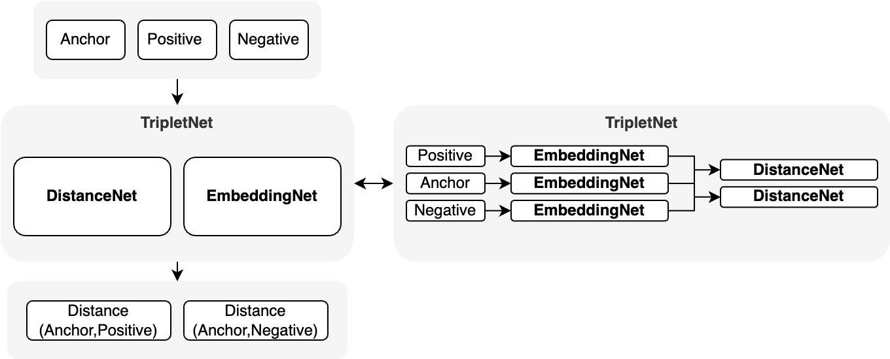
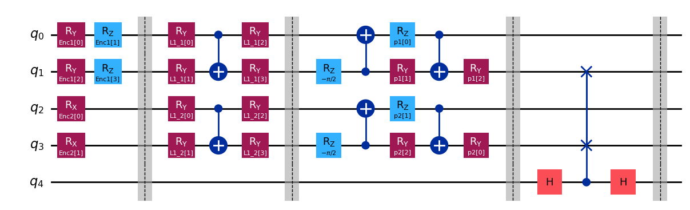
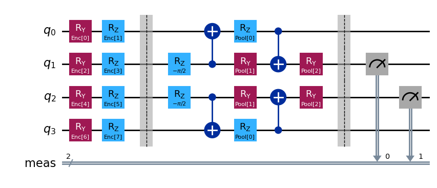

# TriQlet: A PyTorch and Qiskit abstraction layer for Triplet Loss and Hybrid Quantum Learning
## :warning: This repository is still in development, there could be a lot of structural, sintactic and modular changes :warning:

# Table of contents
1. [Introduction](#introduction)
2. [How to use the triplet loss model structure](#tpl)
3. [How to create quantum circuits](#qcc)
4. [How to crate a hybrid quantum triplet loss model](#hql)


## Introduction <a name="introduction"></a>

Simple and modular Python library I wrote to ease the development of my Qiskit quantum circuits in the domain of metric learning (triplet loss with siamese networks). The main goal of this library is treating a quantum model like a PyTorch module, using sequential stacking to compose a circuit made of multiple layers. This library can make you write Qiskit circuit whitout touching the Qiskit library and generate a QuantumLayer that extends Pytorch nn.Module, ready to use in your PyTorch code. Here are some of the QuantumLayer already coded in the library:

<center>

| **Module**             | **Developed**                            |
|------------------------|------------------------------------------|
| Quantum Encoding       | Angles (Y,X), DenseAngle (YZ), Amplitude |
| Quantum Distance       | SwapTest                                 |
| Quantum Ansatz         | RealAmplitude, PoolingLayer              |
| Quantum Neural Network | SamplerQNN                               |

</center>

TriQlet also provides general structure, training function, losses, modules and distance layers for training your custom TripletLoss network. **I want to remark that this library has been developed with my main goals in mind and could be "cranky" in other domain**


## How to use the triplet loss model structure <a name="tpl"></a>

The main class for triplet loss learning consist needs two main modules, an embedder net, that takes in input an example and produces a new representation of that example (from example, a CNN that converts an image to a flatten vector) and a distance net, that takes in input two examples and produces the distance between them. The main TripletNet then takes as input a triplet of (anchor, positive, negative) examples, uses the embedding model to create the embedding and then uses these embedding to compute the distance between (anchor, positive) and (anchor, negative) these tensor can be used with the TripleLoss to compute the loss of the model.

<p align="center">

</p>
So for example, a simple net that creates 8 sized embedding for 1000 sized feature vectors, with Euclidean distance calculation:

```python
from triqlet.triplet.distances import EuclidanDistance
from triqlet.triplet.models import TripletNet

TripletNet(
    embedding = nn.Sequential(
        nn.Linear(1000, 512)
        nn.ReLU(),
        nn.Linear(1000,8)
    ),
    distance = EuclideanDistance()
)


```

## How to create quantum circuits  <a name="qcc"></a>
Lets say you need to create a quantum circuit that encode vector A of size (4) on the first two qubits using YZ encoding, vector B of size (2) on the last two qubits using X encoding, apply a variational quantum circuit based on RealAmplitudes on both lines, make a pooling layer to condense information, and then calculate the distances between these two representation using a Swap Test circuit, then you could do something like this, let's use a QuantumSequential layer to stack all these layers to reach our goal:

```python
QuantumSequential(
        EncoderLayer(5, [0,1], 4, "Enc1", "yz", False), # Apply YZ on qubits [0,1]
        EncoderLayer(5, [2,3], 2, "Enc2", "x", True),   # Apply X on qubits [2,3]  
        RealAmplitudeLayer(5, [0,1], "full", 1, "L1_1", "L1_1", False),  # Apply RA on [0,1]
        RealAmplitudeLayer(5, [2,3], "full", 1, "L1_2", "L1_2", True),   # Apply RA on [2,3]
        PoolingLayer(5, [0], [1], "p1", "P1", False),   # Pooling from qubit [0] to qubit [1]
        PoolingLayer(5, [2], [3], "p2", "P2", True),    # Pooling from qubit [0] to qubit [1]
        SwapTestLayer(5, [1], [3], 4, "Swap", True)     # Swap [1] and [3] with control on [4]
)
```
Will produce exactly this in the format of a Qiskit QuantumCircuit, usable in all your other Qiskit code:  
<p align="center">

</p>
You want to use this in a PyTorch hybrid model? No problem, just use the QuantumSampler wrapper to generate you custom Torch quantum module (in this example we just use YZ encoding, measuring only the central qubits after a pooling layer):    
<br>

```python
quantum_model = QuantumSamplerModel(
    circ_qubits = 4,   # Define a circuit of 4 qubits 
    encoder = EncoderLayer(4, [0,1,2,3], 8, "Enc", "yz", True),  # Apply YZ on all qubits
    ansatz = QuantumSequential(
        PoolingLayer(4, [0,3], [1,2], "Pool", "Pooling", True),  # Pooling from [0,3] to [1,2]
    ),
    shots=1000,       # Measure the circuit 1000 times
    measurement=[1,2] # Apply the measurement on the second and third qubit
)
```
<p align="center">

</p>
Then just use this like a PyTorch neural network, this will ouput the probability distribution estimated on 2 qubit (so 4 values):  

```python
quantum_model(torch.rand((2,8)))
```
```
tensor([[0.7830, 0.1050, 0.0910, 0.0210],
        [0.8430, 0.0400, 0.1110, 0.0060]], grad_fn=<SliceBackward0>)
```

## How to crate a hybrid quantum triplet loss model  <a name="hql"></a>
We have defined everything we need, now let's put all these modules together to create a Hybrid quantum model that first reduces the dimensionality of data to 8 features using a simple linear layer, rescales them for angles encoding, then uses the previously defined quantum model to produces a 4 featues bitsstring distribution and rescaler it using a linear layer:


```python
from triqlet.quantum.models import QuantumSamplerModel
from triqlet.quantum.layers import EncoderLayer, PoolingLayer
from triqlet.utils import RotationScaler
from triqlet.triplet.models import TripletNet
from triqlet.triplet.distances import EuclideanDistance

classical_model = nn.Sequential(
    nn.Linear(1000,512),
    nn.ReLU(),
    nn.Linear(512, 8)
)


quantum_model = QuantumSamplerModel(
    circ_qubits = 4,   # Define a circuit of 4 qubits 
    encoder = EncoderLayer(4, [0,1,2,3], 8, "Enc", "yz", True),  # Apply YZ on all qubits
    ansatz = QuantumSequential(
        PoolingLayer(4, [0,3], [1,2], "Pool", "Pooling", True),  # Pooling from [0,3] to [1,2]
    ),
    shots=1000,       # Measure the circuit 1000 times
    measurement=[1,2] # Apply the measurement on the second and third qubit
)

classical_scaling = nn.Linear(4,4)

model = TripletNet(
    embedding = nn.Sequential(
        classical_model,    # 1000 -> 8
        RotationScaler(),   # Scales in range [0, 2pi]
        quantum_model,      # 8 -> 4 Qubits -> Measure 2 Qubits -> 4
        classical_scaling   # 4 -> 4
    )
    distance=EuclideanDistance()
)
```
Then just use the custom defined training function and you are done!